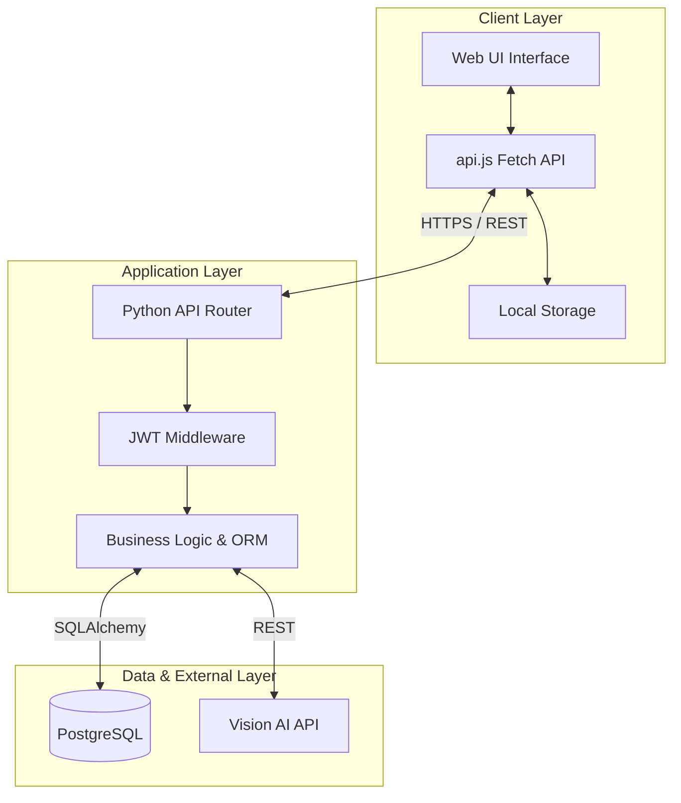
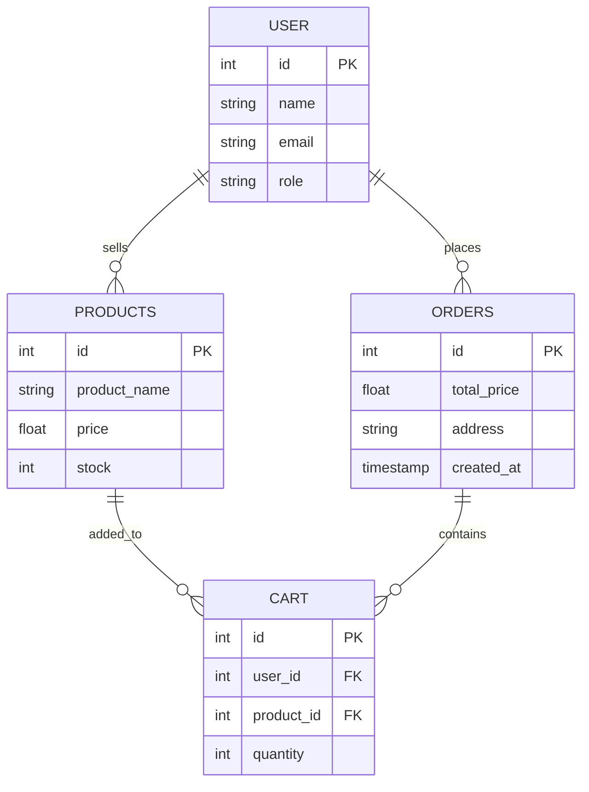
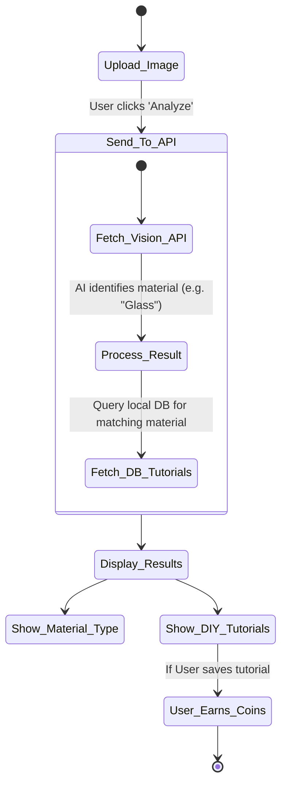
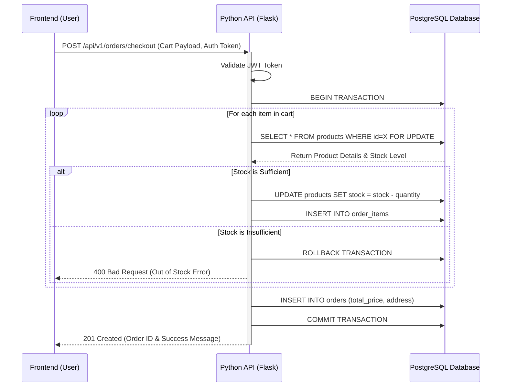

  
  <h1><a href="https://craftcycle.pages.dev">♻️ CraftCycle</a></h1>
  
<strong>Online Eco-Commerce Platform for the Circular Economy</strong>

  
🌍 <strong>Live Website: <a href="https://craftcycle.pages.dev">craftcycle.pages.dev</a></strong>

  
  
  
  
  

---

## 📖 Overview

**CraftCycle** is a comprehensive and user-friendly web-based application developed to streamline the process of purchasing and managing upcycled goods and raw scrap materials in a digital environment. It bridges the gap between material donors, eco-artisans, and customers by providing an interactive and convenient platform. 

The system enables users to effortlessly browse through a wide range of upcycled products, perform advanced searches based on material type, identify recyclable items via an AI scanner, and securely complete their purchases while earning gamified **'Eco Coins'**. 

---

## ✨ Key Features

- 🛍️ **Eco-Marketplace:** Browse, search, and purchase sustainable, upcycled products online. Detailed listings include material type, prices, images, and creator details.
- 🤖 **AI Smart Scanner:** Users can upload or capture photos of waste materials to instantly identify their recyclability and receive DIY upcycling suggestions.
- 🛒 **Real-Time Cart & Secure Checkout:** Add items to a smart cart and seamlessly check out. The system ensures robust real-time stock management.
- 🪙 **Gamification & Eco Coins:** Earn rewards and 'Eco Coins' for completing sustainability challenges and actively participating in upcycling.
- 👥 **Multi-Role Dashboards:** Distinct portal experiences tailored for **Buyers**, **Sellers (Artisans)**, and **Admins**, featuring specialized tools for inventory management, stock control, and order tracking.

---

## 🛠️ Technology Stack

The CraftCycle platform utilizes a decoupled client-server architecture:

| Component | Technology | Description |
| :--- | :--- | :--- |
| **Frontend** | HTML5, CSS3, Vanilla JS | Single Page Application (SPA) using Fetch API for a highly responsive UI. |
| **Backend** | Python, Flask | RESTful API handling business logic, JWT authentication, and AI scanner integration. |
| **Database** | PostgreSQL | Robust Relational Database Management System (RDBMS) via SQLAlchemy ORM. |
| **AI Integration** | Google Vision API / Gemini | Advanced image recognition technology to identify materials from user camera uploads. |

---

## 📐 System Architecture & Workflows

### 1. High-Level Architecture
CraftCycle utilizes a robust decoupled architecture connecting the SPA frontend to the Flask REST API.

### 2. Entity-Relationship (ER) Diagram
A structured overview of the core database entities that map out products, orders, and users:

### 3. AI Smart Scanner Workflow
The logic flow when an eco-conscious user utilizes the AI Scanner feature:

### 4. E-Commerce Checkout Sequence
The transactional flow during the checkout process designed to prevent race conditions on stock inventory:

---

## 🎨 Visual Design System

CraftCycle employs an **"Eco-Chic"** visual design language tailored to communicate sustainability and elegance:
- **Color Palette:** Deep Forest Green (`#2d6a4f`) for primary actions, Earthy Terracotta (`#e07a5f`) for accents, and Off-white Cream (`#f4f1de`) for backgrounds.
- **Typography:** Modern sans-serif fonts (e.g., *Inter* or *Outfit*) for high legibility and a contemporary feel.
- **Dynamic Interface:** Features like skeleton loading screens, smooth CSS transitions, and glassmorphism effects provide a highly responsive user experience.

---

## 🚀 Getting Started

### Prerequisites
- Python 3.8+
- PostgreSQL
- Web Browser (Chrome, Edge, Safari, Firefox)

### Installation Guide
*(Further instructions to setup and run the whole project will go here depending on the deployment strategy.)*

---

  
Built with ❤️ for a Greener Planet.

